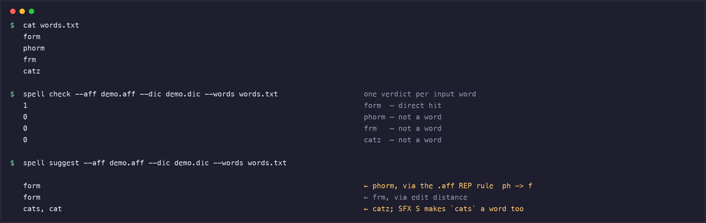

# spell.mbt

[](https://github.com/Careylq/spell.mbt/actions/workflows/ci.yml)

纯 MoonBit 实现的拼写检查库，兼容 **Hunspell 的 `.aff` / `.dic` 词典格式**：
能解析真实世界的词典（如 `en_US`）、按 `.aff` 里的词缀规则做形态推导、像 Hunspell 一样
判定单词，并对判为错误的词给出修改建议。

> **本文件是中文版（`README.zh.mbt.md`）。** 英文版
> [`README.mbt.md`](README.mbt.md) 是**权威版本**：完整的实测表格、逐条未实现清单、
> 性能方法与坑位记录都在那里。本文件覆盖同样的结论与关键数字，但**若两者有出入，
> 以英文版和产出这些数字的脚本为准**。
>
> `README.zh.md` 是本文件的符号链接（GitHub 要能正常渲染）。两个版本都是 `.mbt.md`，
> 所以**其中的 MoonBit 代码块都会被 `moon check` 编译**，不会腐烂。

> **评委速览。** 本仓库就是提交内容 —— 验收读的是 git 快照，所以需要的一切都在仓库里：
>
> | 项 | 值 |
> |---|---|
> | 官方语料符合率 | `.good` **847/854 = 99.2%** · `.wrong` **611/613 = 99.7%** |
> | 与 hunspell 1.7.3 差分测试 | 235,976 个真实词：分歧 **199 个 = 0.084%** |
> | 测试 | **200** 个（wasm / wasm-gc / js）· **204** 个（native） |
> | 直接查表 vs hunspell | **持平**（0.32–0.38 vs 0.36–0.38 µs/词；比值会跨过 1.0） |
> | wasm 产物 | **142.2 KiB**，无 C++ 运行时 |
>
> [`ACCEPTANCE.md`](ACCEPTANCE.md) 是**逐条自检表**，对照全部五份验收口径 ——
> 章程阶段三（9 条）、章程第七章（10 条）、官网（6 条）、组委会邮件的 4 个评估维度、
> 以及本项目自己的申报书。其中也写明了申报书里哪些承诺**被超额完成**、
> 以及哪一处承诺**当时并不成立、已修复**。上表每个数字都由仓库内脚本产出：
> `bash check-all.sh` 可全部重跑（需要联网；差分那一行还需要系统装有 `hunspell` 与
> `/usr/share/dict/words` —— 每条命令的前提条件列在
> [`ACCEPTANCE.md`](ACCEPTANCE.md#八如何复现) §八）。

> **状态：0.9.6。** `.aff`/`.dic` 解析器、词缀引擎、`spell()` 判定引擎、建议引擎、
> 公开 API 与 `check`/`suggest` 两个 CLI 子命令均已实现，并在四个后端上测试通过。
> 尚未实现的部分见英文版 *Not implemented yet*。



*这是 `bash examples/basic/demo.sh` 的**逐字输出**（离线跑，词典由脚本自己写出，只有三条）。
每行一个词：`1` = 正确，`0` = 不是词。右侧注释是为可读性加的，除此之外没有改动——脚本
可逐字节复现这段输出。值得一读，是因为四个词各走了一条不同的代码路径：`form` 是直接命中；
`cats` 不在词典里，但 `.aff` 的 `SFX S` 规则让它成立；`phorm` 靠 `REP ph f` 规则找到
`form`；`frm` 靠编辑距离。*

## 目录

- [为什么做这个](#为什么做这个) —— 这个库填的是生态里的哪个空缺
- [安装](#安装) 与 [快速开始](#快速开始)（含 `moon.pkg` 写法、[命令行](#命令行)）
- [实测数据](#实测数据) —— [符合率](#官方语料符合率) ·
  [差分测试](#与真实-hunspell-的差分测试) · [性能](#性能原生二进制对原生二进制) ·
  [产物体积](#产物体积) · [工程质量](#工程质量)
- [示例](#示例) —— 三个可运行示例
- [开源合规](#开源合规)
- [社区文章](#社区文章) · [许可证](#许可证)

## 为什么做这个

**申报时（2026 年 9 月）**，用 `hunspell` / `spell` / `affix` / `stemmer` / `snowball` /
`hyphenation` / `thesaurus` 检索 mooncakes.io **均为 0 命中**——当时生态里没有 Hunspell 格式
解析器、没有词缀形态学、没有拼写判定。相近的包解决的是别的问题（`moonlexicon` 是多模式串
匹配；`moonnlp`、`tokenizers-moonbit` 是 NLP/LLM 分词器）。Hunspell 格式已有几百种语言的
成熟词典，这个库让那些现成资源在 MoonBit 里能用。

**但这句话现在不再字面成立，所以这里如实写明**：2026-09-27（本项目首发于 09-22 之后），
生态里出现了**另一个定位相同的包** [`wccerty/moonspell`](https://mooncakes.io/docs/wccerty/moonspell)
（"A pure-MoonBit Hunspell-compatible spelling engine"，Apache-2.0）。两者是各自独立的实现。
一个 registry 里出现同一标准格式的两个实现是健康的结果，所以诚实的说法不是"只有我们"，
而是**这个实现可核验地做到了什么**：

| | 本项目 | `wccerty/moonspell` |
|---|---|---|
| 首发 | 2026-09-22 | 2026-09-27 |
| 已发布版本 | 15 个（0.1.0 → 0.9.6） | 1 个（0.1.0） |
| 官方语料符合率 | `.good` 847/854 = 99.2% · `.wrong` 611/613 = 99.7% · `.sug` 141/173 = 81.5% | 其包页未给出 |
| 与 hunspell 在 23.6 万真实词上的差分测试 | 已公开，分歧 0.084% | 未公开 |
| 许可证 | Apache-2.0 | Apache-2.0 |

第三行是本仓库的实测数字；对方是新包，日后可能给出等价数据。这个对比的意义只在于：
生态里现在有得选了，而本项目的立足点是**实测的符合率**，不是"我们最早"。

## 安装

```bash
moon add Careylq/spell
```

`moon add` 只把依赖写进 `moon.mod`。**使用方自己的 `moon.pkg` 里还要 import 它**：

```text
import {
  "Careylq/spell",
}
```

如果要在 blackbox 测试文件（`*_test.mbt`）里用，import 要声明到 `test` 作用域，
否则 `moon check --deny-warn` 会报 `unused_package`（**即使测试本身是通过的**）：

```text
import {
  "Careylq/spell",
} for "test"
```

## 快速开始

词典加载一次，之后想判多少词就判多少词。模块根再导出了公开 API：

```mbt check
///|
test {
  let dictionary = @spell.load("SET UTF-8\nSFX S Y 1\nSFX S 0 s .", "1\ncat/S")
  assert_true(@spell.check(dictionary, "cat"))
  assert_true(@spell.check(dictionary, "cats"))
  assert_false(@spell.check(dictionary, "dog"))
}
```

`load` 在文本格式不对时会**抛错**，所以要在加载处处理——同样的 `catch` 写在普通
`main` 里也可以：

```mbt check
///|
test {
  let dictionary = @spell.load("SET UTF-8", "1\ncat") catch {
    error => abort("词典加载失败: \{error.to_string()}")
  }
  assert_true(@spell.check(dictionary, "cat"))
}
```

也可以把入口声明成 `fn main raise` 让错误往上抛。
[`examples/basic`](examples/basic/main.mbt) 是这两种写法的可运行版本。

判为错误之后，`suggest` 返回的是 `check` 自己也会接受的修改建议，最优在前：

```mbt check
///|
test {
  let dictionary = @spell.load(
    "SET UTF-8\nTRY abcdefghijklmnopqrstuvwxyz\nREP 1\nREP ph f", "3\nform\nhello\nphantom",
  )
  assert_eq(@spell.suggest(dictionary, "phorm", 5), ["form"])
}
```

## 命令行

`cmd/main` 是本模块自己的可执行包，所以下面这些命令要在**本仓库的克隆里**运行；
依赖本库的项目**不能**按路径 `moon run` 它。

```bash
moon run cmd/main -- check   --aff en_US.aff --dic en_US.dic --words -
moon run cmd/main -- suggest --aff en_US.aff --dic en_US.dic --words -
```

`--words -` 从标准输入逐行读词，`--words <file>` 读文件。`check` 对**每个非空输入行**
输出一行判定（`1` 正确 / `0` 错误），顺序与输入一致；空行不输出，所以输出行与非空输入行
严格一一对应。词典只解析、索引一次。

## 实测数据

所有数字都由脚本跑出，不是估的。一条命令复现全部指标：

```bash
bash check-all.sh
```

### 官方语料符合率

对着 Hunspell 官方测试语料（**155 个套件、854 个 `.good` 判定**，语料钉在 tag `v1.7.4`）实测：

| 指标 | 通过 | 总数 | 通过率 |
|---|---|---|---|
| `.good`（必须接受） | **847** | 854 | **99.2%** |
| `.wrong`（必须拒绝） | **611** | 613 | **99.7%** |
| `.sug`（期望首选建议被产出） | **141** | 173 | **81.5%** |

未通过的 `.good` **正好 7 个**，全部集中在英文版已列明的未实现项上：ALL-CAPS 输入去匹配
混合大小写词条（6 个判定）、匈牙利 `LANG hu` 的 moving rule（1 个）。未通过的 `.wrong`
只有 2 个。

> 这里曾长期写着 **97.3%**。那是**度量假象**：早期 harness 用 `paste -d' '` 按位置配对
> 输入流和判定流，任何含空格的语料行都会错位并被无条件记为失败（`morph.good` 有 16 行
> `drink eat` 这种）。改成"每个非空输入行一个判定、直接计数"后是 99.2%——
> **引擎行为一个字都没变**，之前的数字一直是低估。

### 与真实 hunspell 的差分测试

```bash
bash conformance/differential.sh
```

在 `/usr/share/dict/words`（**235,976 词**）上，本库与原生 `hunspell 1.7.3` 的判定差异
**199 个（0.084%）**。两行方向相反，要按定义读：

- 「该接受却拒绝」**1 个**（`Jean-Christophe`）—— 这是本库**比 Hunspell 严**的那一个词。
- 「该拒绝却接受」**198 个** —— 这是**本库比 Hunspell 宽松**：这些词 Hunspell 判错、本库判对，
  形如 `sparingness` / `winkered` / `towser` / `yester` 的 `-ness`/`-er`/`-ed` 派生形态
  （本库的词缀引擎在 Hunspell 不接受的词干上允许了这些后缀）。

这 198 个**不是回归**——在引入复合词引擎之前的提交上重跑同一测量，结果完全相同。

### 性能（原生二进制对原生二进制）

同一份 `.aff`/`.dic`、同一份词表：

| 指标 | 本库 | Hunspell 1.7.3 | 倍数 |
|---|---|---|---|
| 进程启动 | 0.0020 s | 0.0030 s | 0.67×（略快） |
| 词典加载（49,568 词条） | 0.030 s | 0.007 s | 慢 4.29× |
| **直接命中，仅查找** | **0.38 µs/词** | 0.36 µs/词 | **1.06×（持平）** |
| 未命中，仅查找 | 9.60 µs/词 | 1.49 µs/词 | 慢 6.44× |

**差距是精确定位的**：全在**未命中路径**（每个被拒的词要把每条后缀规则、前缀规则、
前缀×后缀叉积和双后缀族全试一遍）与**词典加载**；**直接查表已与 Hunspell 持平**。

### 产物体积

wasm **142.2 KiB** · wasm-gc **110.7 KiB** · js 458.1 KiB · native 743.3 KiB。
wasm 产物 142 KiB 且**无 C++ 运行时**。

### 工程质量

**200 个测试**（native **204 个**）× 四后端全通过 · `moon check --deny-warn --target all`
0 warning · `moon fmt --check` 干净 · `moon info` 的 `.mbti` diff 为空 ·
`docs/MOONBIT_GOTCHAS.md` 收录 **43 条**由编译器/运行时验证的 MoonBit 坑。

## 示例

| 示例 | 说明 |
|---|---|
| [`examples/basic`](examples/basic) | `moon run examples/basic` 直接跑，现写词典并判定一组词 |
| [`examples/doccheck`](examples/doccheck) | 用本库检查 MoonBit 仓库自己的文档与注释，抽出 `文件:行: 词`；退出码 `0` 干净 / `1` 发现拼写错误 / `2` 用法或 I/O 错误（wrapper 另有 `3` = 取不到词典），**可作 CI 门禁** |
| [`examples/ci-gate`](examples/ci-gate) | 离线证明上面那套退出码契约真的能拦住构建，含可直接抄的 workflow |

## 开源合规

- 本项目 **Apache-2.0**（OSI 认可）
- **参考 Hunspell（LGPL-2.1）的格式规范与可观察行为，未复制、翻译或改写其 C++ 源码**，
  因此不引入 LGPL 衍生代码义务。参考范围（项目名、链接、许可证、范围）在
  [`NOTICE`](NOTICE) 中逐项声明
- **第三方语料与词典不随仓库分发**：Hunspell 官方语料、`en_US` 词典（LibreOffice 项目，
  源自 SCOWL）都由脚本在运行时拉到临时目录，用完即删
- 唯一第三方依赖是 `moonbitlang/x`（纯 MoonBit）

## 社区文章

- **《AI 写了 7300 行 MoonBit：编译器能验的，和验不了的》** —— 用 AI 辅助构建这个库的
  完整复盘，重点在**三层验证**：编译器查语法与类型、测试查语义，而**性能与度量只能靠重测**。
  文中两个真实案例：一次被重测抓出的 **2.31× 性能回归**，以及一处被修正的
  **度量口径错误（符合率被低估 1.9 个百分点）**。
  - 知乎 —— https://zhuanlan.zhihu.com/p/2087606024068976886
  - 掘金 —— https://juejin.cn/post/7689644399769796649

## 许可证

[Apache-2.0](LICENSE)
